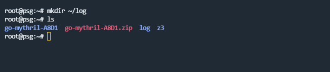
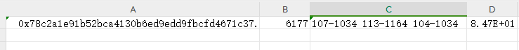

# PSG: Faster Vulnerability Detection of Smart Contracts
## Introduction
PSG is a symbolic execution tool for vulnerability detection of smart contracts based on a **P**arallel-friendly architecture, **S**tate-complexity-oriented halting algorithm, and **G**reedy state exploration algorithm.
We implement most part of PSG in Golang.
## Running Guide on Linux
Before running PSG, Golang and Z3 should be installed first.  
### Install Golang
```bash
wget https://studygolang.com/dl/golang/go1.20.linux-amd64.tar.gz
rm -rf /usr/local/go && tar -C /usr/local -xzf go1.20.linux-amd64.tar.gz
export PATH=$PATH:/usr/local/go/bin
go version
```

### Install Z3
```bash
git clone https://github.com/Z3Prover/z3.git
```

```bash
cd z3
python3 scripts/mk_make.py
```

```bash
cd build
make -j8
```

```bash
sudo make install
```


### Download PSG
Click and download the zip file of this repo as [``go-mythril-A8D1.zip``](go-mythril-A8D1.zip) .  
Or see it in the left of [https://anonymous.4open.science/r/go-mythril-A8D1/](https://anonymous.4open.science/r/go-mythril-A8D1/README.md).

### Run PSG
Before running PSG, some configuration information should be changed.
```bash
mkdir ~/log
```

```bash
unzip go-mythril-A8D1.zip
cd ~/go-mythril-A8D1/go-mythril
```
  

Change the z3 path in [``goZ3Config.h``](laser/smt/z3/goZ3Config.h) and [``config.go``](laser/smt/z3/config.go) with your own z3 path.
```bash
vim laser/smt/z3/goZ3Config.h
```
  

```bash
vim laser/smt/z3/config.go
```
  
  

If you are a root user, you should delete 'sudo' in psg.sh.
```bash
vim psg.sh
```
  

Run the psg.sh. It will load the opCode of an example smart contract and save the result as a csv file. The relevant log can be obtained in `~/log/`.
```bash
chmod 777 psg.sh
./psg.sh
```
  

The csv file displays contract's name(col A), total States(col B), vulnerabilities(col C) and detection time(col D).  

 


